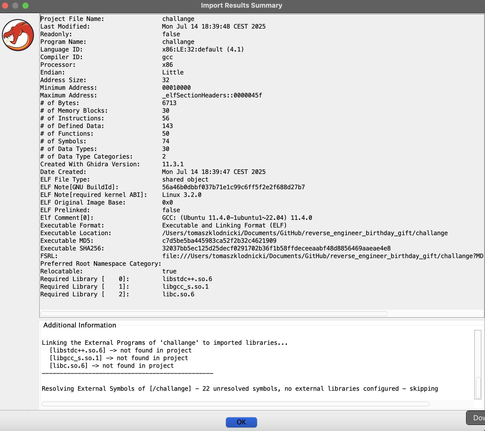
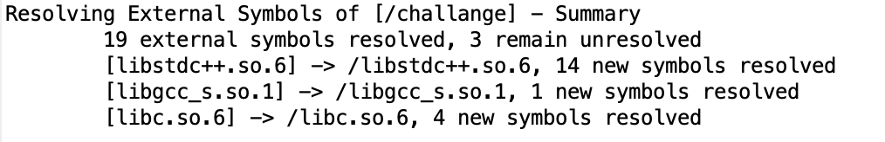

```
 _     _      _   _         _             
| |__ (_)_ __| |_| |__   __| | __ _ _   _ 
| '_ \| | '__| __| '_ \ / _` |/ _` | | | |
| |_) | | |  | |_| | | | (_| | (_| | |_| |
|_.__/|_|_|   \__|_| |_|\__,_|\__,_|\__, |
                                    |___/ 
      _           _ _                       
  ___| |__   __ _| | | ___ _ __   __ _  ___ 
 / __| '_ \ / _` | | |/ _ \ '_ \ / _` |/ _ \
| (__| | | | (_| | | |  __/ | | | (_| |  __/
 \___|_| |_|\__,_|_|_|\___|_| |_|\__, |\___|
                                 |___/      
```

## About

I received this program as a birthday gift from a friend of mine. The challenge is to reverse engineer it and uncover the hidden password. The program was created by [Nefretus](https://github.com/Nefretus). Thanks!

## Setp 1

```bash
strings challange > string.txt
```

Let’s see the hardcoded strings inside this file. There’s no password for sure, but what do we have here?

```
przekaz haslo jako pierwszy command line argument 
Sza sza sza!!!
No niestety byku
```

Now we now what we need to get as output sza sza sza!!! :D

```
GCC: (Ubuntu 11.4.0-1ubuntu1~22.04) 11.4.0
```

And it was compiled on ubuntu.

## Step 2

To get info about build arch lets exectue `file` command

```bash
file challenge > file.txt
```

Now we know that it's for `x86` and there is no debug info commpiled inside.

## Step 3

Let's go to `Ghidra`.



I encountered an issue loading libraries from the x86 architecture because I’m using an Apple ARM machine. To resolve this, I Located the missing libraries on my Linux x86 machine, copied them to ./libs/ and imported them into Ghidra, which resolved the errors.



Next, I searched for the entry point `libc.so.6::__libc_start_main` and locate `main()` function.